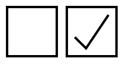

# CheckboxButton
[](https://travis-ci.org/chrisamanse/CheckboxButton)
[](https://github.com/Carthage/Carthage)

A checkbox button UI component for iOS built with Swift.



**`CheckboxButton`**
  - A subclass of `UIControl`. The container will fit the frame of the control while maintaining its aspect ratio.

# Installation

This project can be installed in different ways:
  - Manual
    1. Download the project
    2. Simply copy `CheckboxButton.swift` to your project
  - Framework
    1. Download the project
    2. Build the **CheckboxButton** framework
    3. Embed the framework into your project
  - [Carthage](https://github.com/carthage/carthage)
    1. Add `github "chrisamanse/CheckboxButton"` in your Cartfile

# Usage

`CheckboxButton` can be used in two different ways:
  - Interface Builder
    - Simply change the class of the `UIButton` to `CheckboxButton`.
  - Code
    - Use the initializer: `init(frame: CGRect)`

You can run the example app located in the same project to see how it's used.

## Toggle

`CheckboxButton` will be toggled when a `.TouchedUpInside` event occurred. You can observe changes in state using the `UIControlEvents.ValueChanged` event.

You can check if the checkbox is toggled by reading the `on` property. You can also set this property to programmatically set the state of the checkbox.

```swift

if checkbox.on {
  print("Checkbox is checked")
}

// Toggle
checkbox.on = false // Set to false to uncheck

```

# License

Copyright (c) 2016 Joe Christopher Paul Amanse

This software is distributed under the [MIT License](./LICENSE).
